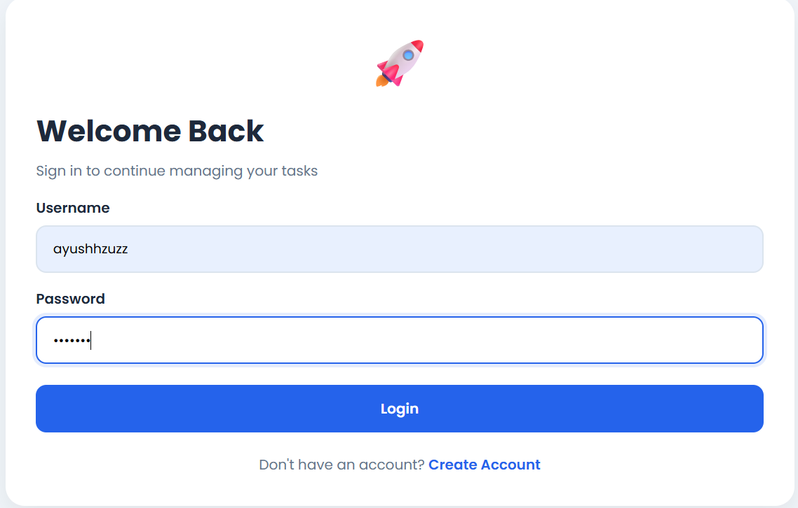
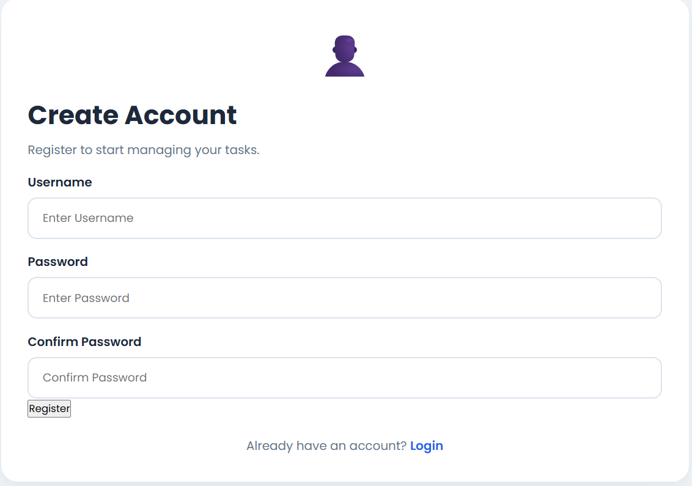
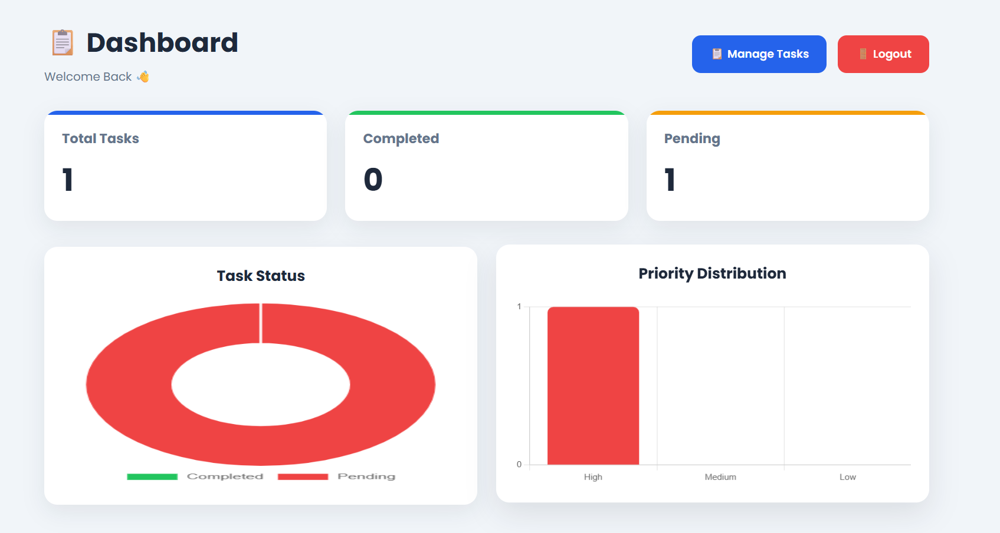
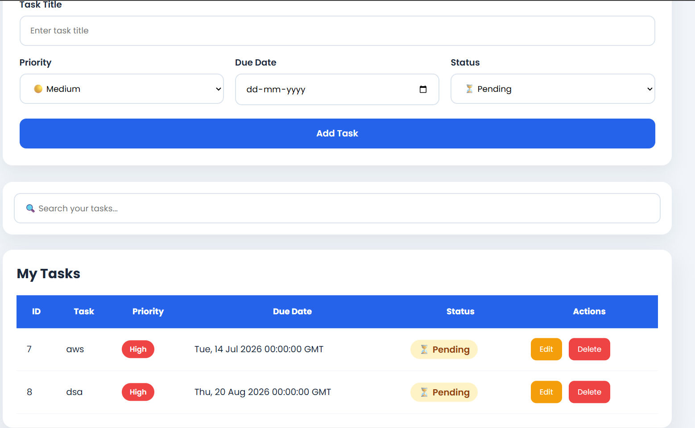

# Flask Task Management

A full-stack Task Management web application built with **Flask**, **MySQL**, **HTML**, **CSS**, and **JavaScript**. The application allows users to securely register, log in, and manage their daily tasks with complete CRUD (Create, Read, Update, Delete) functionality.

> **Deployment:** Render  
> **Database:** Railway MySQL  
> **Containerization:** Not used in this version (Docker support planned for future releases.)

---

## 🚀 Live Demo

**Application:**  
https://flask-task-management-jx6a.onrender.com

---

## ✨ Features

- User Registration
- User Login & Logout
- Session-based Authentication
- Create Tasks
- View Tasks
- Update Task Status
- Delete Tasks
- MySQL Database Integration
- Responsive User Interface
- Cloud Database (Railway)
- Hosted on Render

---

## 🛠 Tech Stack

### Backend

- Python
- Flask
- Flask-CORS
- PyMySQL

### Frontend

- HTML5
- CSS3
- JavaScript

### Database

- MySQL (Railway)

### Deployment

- Render

---

## 📂 Project Structure

```text
Flask-Task-Management/
│
├── screenshots/
│   ├── login.png
│   ├── register.png
│   ├── dashboard.png
│   └── task-management.png
│
├── task management/
│   └── task-management/
│       ├── static/
│       │   ├── css12/
│       │   └── js12/
│       ├── templates/
│       ├── app.py
│       ├── database.py
│       └── requirements.txt
│
├── LICENSE
└── README.md
```

---

## 📸 Screenshots

### Login Page



---

### Register Page



---

### Dashboard



---

### Task Management



---

## ⚙ Installation

### Clone the repository

```bash
git clone https://github.com/ayush-cpu-art/Flask-Task-Management.git
```

### Navigate to the project directory

```bash
cd "task management/task-management"
```

### Install dependencies

```bash
pip install -r requirements.txt
```

### Run the application

```bash
python app.py
```

The application will start on:

```
http://127.0.0.1:5000
```

---

## 🔑 Environment Variables

Configure the following variables before running the application:

```env
DB_HOST=
DB_PORT=
DB_USER=
DB_PASSWORD=
DB_NAME=
SECRET_KEY=
```

---

## 📌 Future Improvements

- Docker Containerization
- Password Hashing using bcrypt
- Task Categories
- Due Dates
- Task Priorities
- Search & Filter Tasks
- REST API
- JWT Authentication
- Email Verification
- Password Reset
- User Profiles
- Dark Mode

---

## 📜 License

This project is licensed under the **GPL-3.0 License**.

---

## 👨‍💻 Author

**Ayush Dev**

GitHub: https://github.com/ayush-cpu-art

---

⭐ If you found this project useful, consider giving it a star!
